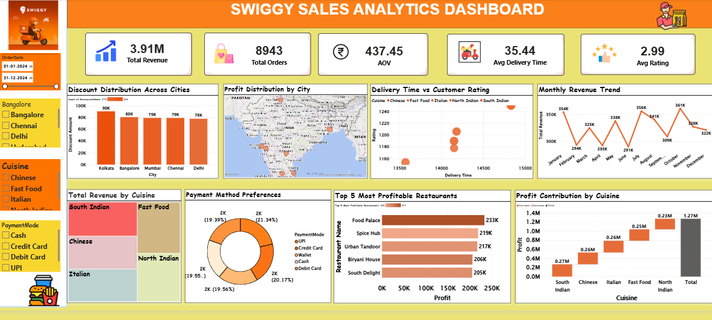

##🍔 Swiggy Sales Dashboard

An interactive **Power BI dashboard** developed to analyze Swiggy sales performance, customer ordering behavior, restaurant insights, and key business KPIs.
 
 📷 Dashboard Preview

 ##📌 Project Overview

This dashboard provides an interactive analysis of Swiggy's sales data, helping businesses understand customer behavior, restaurant performance, sales trends, and operational metrics. The dashboard enables users to explore insights through dynamic filters and visualizations.

##🎯 Business Objectives

1. Analyze overall sales performance
2. Track customer ordering behavior
3. Identify top-performing restaurants
4. Compare food category performance
5.Monitor revenue trends
6. Support data-driven business decisions

 ##📊 Key Performance Indicators

1.Total Revenue
2.Total Orders
3.Average Order Value (AOV)
4.Average Delivery Time
5.Average Customer Rating

## Dashboard Features
1.KPI Cards
2.Interactive Slicers
3.DAX Measures
4.Interactive Charts
5.Cross Filtering & Cross Highlighting
6.Map Visualization
7.Responsive Dashboard Layout

 ## Tools & Technologies

1.Microsoft Power BI
2. Power Query
3.DAX

## 💼 Skills Demonstrated

1. Data Cleaning
2.Data Transformation
3. Data Modeling
4. DAX Calculations
5. Dashboard Design
6. Business Intelligence
7. Data Visualization

## 📂 Repository Contents

| File | Description |
| Swiggy_Sales_Dashboard.pbix | Power BI project |
| Dashboard.png | Dashboard preview |
| Swiggy_Sales_Dashboard.pdf | PDF version |
| Swiggy_Sales_Dataset.xlsx | Dataset |

 ## How to View

1. Download the `.pbix` file.
2. Open it using Microsoft Power BI Desktop.
3. Explore the interactive dashboard using the available filters.

## 📌 Conclusion

This project demonstrates my ability to clean, transform, analyze, and visualize business data using Power BI. It showcases practical skills in KPI development, interactive dashboard design, and business analytics.
